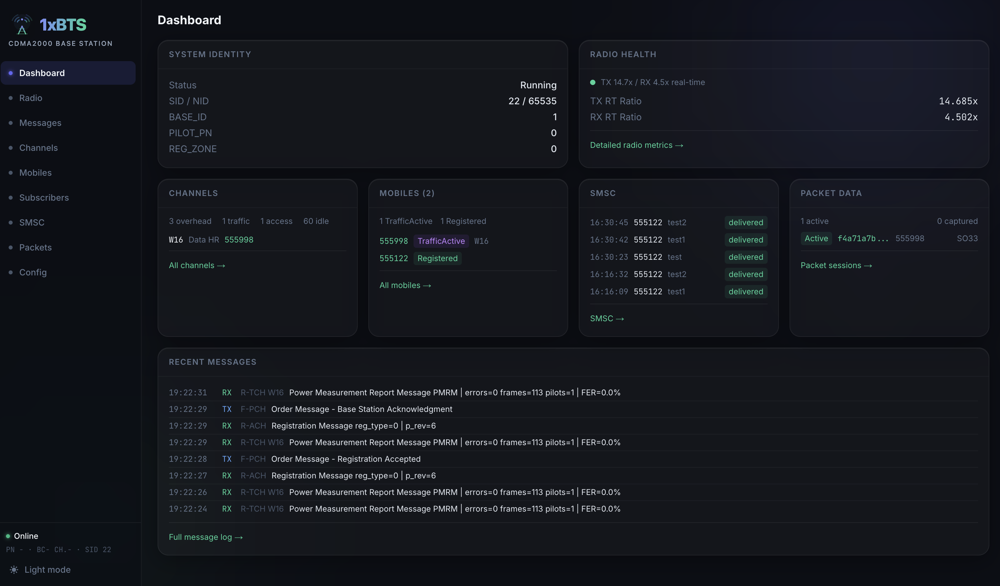

# 1xBTS

[](https://1xbts.org)
[](https://1xbts.org/docs)
[](https://github.com/chrismoos/1xbts/actions/workflows/ci.yml)
[](LICENSE)
[](Cargo.toml)

1xBTS is an experimental CDMA2000 1x base station and core-network stack
implemented primarily in Rust. It includes BTS, BSC, MSC, HLR, SMSC, packet
data, voice, SDR radio backends, and a web dashboard for development and
operation.

This project is intended for research, interoperability testing, and lab use.
Operate RF hardware only where you are authorized to transmit. You have been warned.

<a href="docs/images/screenshot.png">
  
</a>

## Why 1xBTS

While CDMA2000 was a major technology in the US and some other places around the world, 
it was never as ubiquitious as other standards like GSM. Up until now there has never been
a way to revive old CDMA2000 devices. I started this project to change that.

## Status

1xBTS is under active development. The current stack can run as a
network-in-a-box process for local integration, or split BTS/BSC operation over
the included Abis transport. Support varies by handset, radio backend, channel
configuration, and service option.

Currently many things are working (SMS, Voice, Packet Data) and while they work
there is still much work to be done for production hardening. It still is a lot of fun
though.

## Architecture

The Rust workspace keeps first-party crates flat under `crates/` and external
integration wrappers under `external/`:

- `crates/` - CDMA protocol, RAN, core-network, packet, voice, and tooling crates.
- `external/` - SDR, SIP/native, and other outside-library wrapper crates.
- `1xbts-web` - Next.js dashboard backed by the management gRPC APIs.
- `proto` - protobuf service definitions.

Full documentation lives at [1xbts.org/docs](https://1xbts.org/docs).

### Network Nodes

The stack implements the full 3GPP2 1x reference architecture, with each node
running as its own process and communicating over standard reference points:

- **BTS** (`cdma-bts`) - air-interface PHY/MAC, SDR-driven radio.
- **BSC** (`cdma-bsc`) - radio resource management; speaks Abis to the BTS.
- **MSC** (`cdma-msc`) - circuit-switched core; speaks A1 to the BSC.
- **HLR** (`cdma-hlr`) - subscriber database (PostgreSQL-backed).
- **SMSC** (`cdma-smsc`) - short message service center.
- **PCF** (`cdma-pcf`) - packet control function; A8/A9 to BSC, A10/A11 to PDSN.
- **PDSN** (`cdma-pdsn`) - packet data serving node, FoU/TUN packet path.
- **voice-gw** (`cdma-voice-gw`) - SIP gateway for outbound voice calls (PSTN origination). See [voice gateway setup](https://1xbts.org/docs/guides/voice-gateway/) for trunk + STUN configuration.
- **NIB** (`cdma-nib`) - network-in-a-box launcher that runs the full stack in one process.

## Prerequisites

At minimum:

- Rust toolchain with Cargo.
- PostgreSQL for HLR/SMSC state (`docker compose up -d postgres` starts a local `1xbts` database on port 45432).
- `protoc` for protobuf code generation (Ubuntu/Debian: `protobuf-compiler`).
- `pkg-config` and a C compiler for native bindings.
- `libclang` for bindgen (Ubuntu/Debian: `libclang-dev`).

Optional radio and voice dependencies depend on enabled features and hardware:
UHD/USRP, LimeSuite, SoapySDR, bladeRF, and Baresip libre/re.

### Ubuntu / Debian

Common packages (always required):

```sh
sudo apt-get install -y \
    build-essential pkg-config protobuf-compiler libssl-dev \
    libclang-dev libre-dev
```

Then add the packages for whichever SDR backend(s) you plan to enable:

**bladeRF** (`--features bladerf-backend`):

```sh
sudo apt-get install -y libbladerf-dev
```

**UHD / USRP** (`--features uhd-backend`):

```sh
sudo apt-get install -y libuhd-dev
```

**LimeSDR** (`--features lime-backend`):

```sh
sudo apt-get install -y liblimesuite-dev
```

### Tested SDR Hardware

- bladeRF Micro 2.0
- Ettus USRP B210 (UHD)
- LimeSDR Mini v2

Other SoapySDR-compatible devices may work but are not regularly exercised.

### Tested Handsets

- Apple iPhone (CDMA)
- Motorola V60s
- Qualcomm QCP-860
- Nokia Lumia 735
- Samsung SCH-U340
- BlackBerry 8830

## Quick Start

Clone, bring up the support services, and run the network-in-a-box:

```sh
git clone https://github.com/chrismoos/1xbts.git
cd 1xbts

# Linux:
sudo modprobe fou ipip   # load kernel modules required by fou-nat
docker compose up -d --build

# macOS (uses bridge networking + host.docker.internal):
docker compose -f docker-compose.yml -f docker-compose.macos.yml up -d --build

# postgres :45432 · dashboard :3000 · fou-nat :17012 · speed test :5656
cargo run --release -p cdma-nib --no-default-features --features bladerf-backend -- \
    --config-dir config \
    --radio-config config/radio_bladerf_micro2.json
```

Default service ports are listed in `docs/PORTS.md`. If port 3000 is already in
use, set `ONEXBTS_WEB_PORT`, for example `ONEXBTS_WEB_PORT=3001 docker compose up 1xbts-web`.
Use `--build` after pulling repo updates so Compose rebuilds images that copy
local files, such as `fou-nat` and `speedtest`.
The packet-data speed test is available on the host at `http://localhost:5656`
by default, and from mobile packet-data clients at `http://speed/` or
`http://speed.local.1xbts.org/`.

To customize a config without editing the checked-in defaults, drop a sibling
`<name>.local.json` next to it (e.g. `config/bts.local.json`). The loader
deep-merges the local file on top of the base before validation. `*.local.json`
is gitignored. See the [Configuration guide](https://1xbts.org/docs/getting-started/configuration/#local-overrides).
Packet-data DNS advertised to mobiles is configured in `config/pdsn.json` under
`packet.primary_dns` and `packet.secondary_dns`; the checked-in defaults point to
the FOU gateway resolver so `speed` and `speed.local.1xbts.org` resolve locally.

### SDR Backend Features

Enable exactly one SDR backend at build time:

| Ubuntu package     | Hardware            | Cargo feature                |
| ------------------ | ------------------- | ---------------------------- |
| `libbladerf-dev`   | bladeRF devices     | `--features bladerf-backend` |
| `libuhd-dev`       | USRP B200/B210      | `--features uhd-backend`     |
| `liblimesuite-dev` | LimeSDR devices     | `--features lime-backend`    |

### Tests

Run focused tests while developing:

```sh
cargo test -p cdma-bts
cargo test -p cdma-bsc
```

### Web Dashboard

The dashboard ships in `1xbts-web` (Next.js) and is started by `docker compose up`
above. To run it directly:

```sh
cd 1xbts-web
npm install
npm run dev
```

## Support

- **GitHub Discussions** — [github.com/chrismoos/1xbts/discussions](https://github.com/chrismoos/1xbts/discussions) for questions, ideas, and show-and-tell.
- **GitHub Issues** — [github.com/chrismoos/1xbts/issues](https://github.com/chrismoos/1xbts/issues) for bug reports and feature requests.
- **IRC** — `#1xbts` on [Libera.Chat](https://libera.chat) for live chat.

## License

The main 1xBTS workspace is licensed under Apache-2.0. The SDR wrapper crates
under `external/` (`bladerf`, `bladerf-sys`, `limesuite`, `limesuite-sys`, `uhd`,
`uhd-sys`) are dual-licensed `MIT OR Apache-2.0`; see the individual `Cargo.toml`
files for package-level license metadata.

The optional native Baresip libre/re dependency used by the SIP voice gateway is
provided by the system and is distributed upstream under BSD-3-Clause terms.
